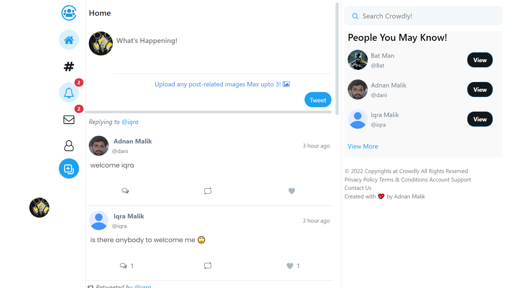

# Crowdly - A Real Time Full Stack  Twitter Clone

Crowdly is a Full Stack Advanced Project created using Node Js ,Express Js, MongoDB, Socket.io and AWS micro services.
This project contains all basic functionality not just creating `tweets`, `like` ,`reply`, `retweet` , `follow` , `real time chat` `group chat` `real time notificatoin`, `mongoose-changeStreams`

**Note: Project also contains real time chat, group chat , uploading  images to S3 Bucket and much more**

## Available Scripts

In the project directory, you can run:

### `npm start`

Runs the app in the development mode.\
Open [http://localhost:3000](http://localhost:3000) to view it in the browser.

### `Live Demo`
You can view website on this Link [Click Here](https://crowdly-twitter-clone.onrender.com) 

**Note: You Have to First run `npm i` to install all dependencies packages**

### Reach me!
Follow me on [Instagram](https://www.instagram.com/dani__graphicz/?hl=en)
Email me on `madnanmushtaq000@gmail.com`
If you found  it helpful make sure to give it a `Star`
**Note: If you found any bugs Kindly reach me out, make a pull request, I am always looking for to learn and make somthing that matters!**